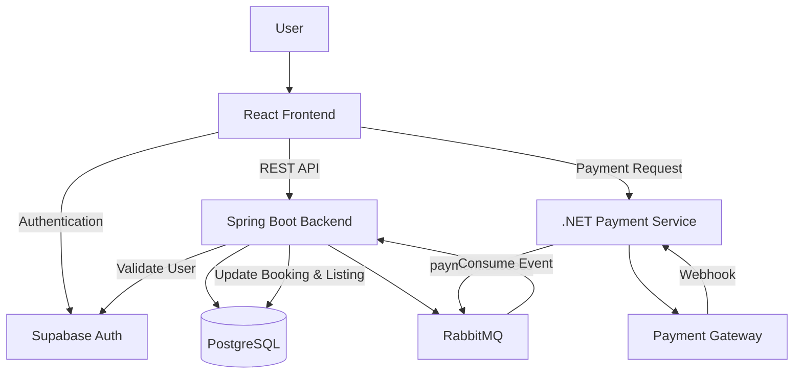
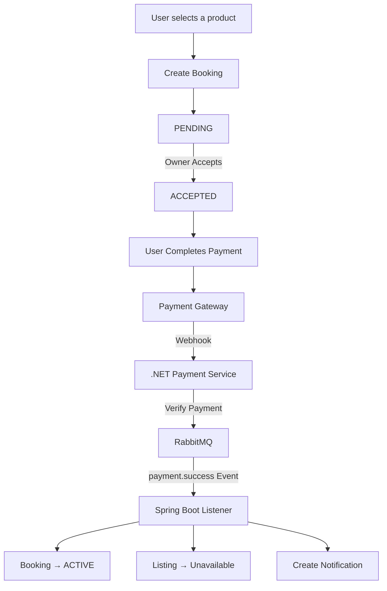
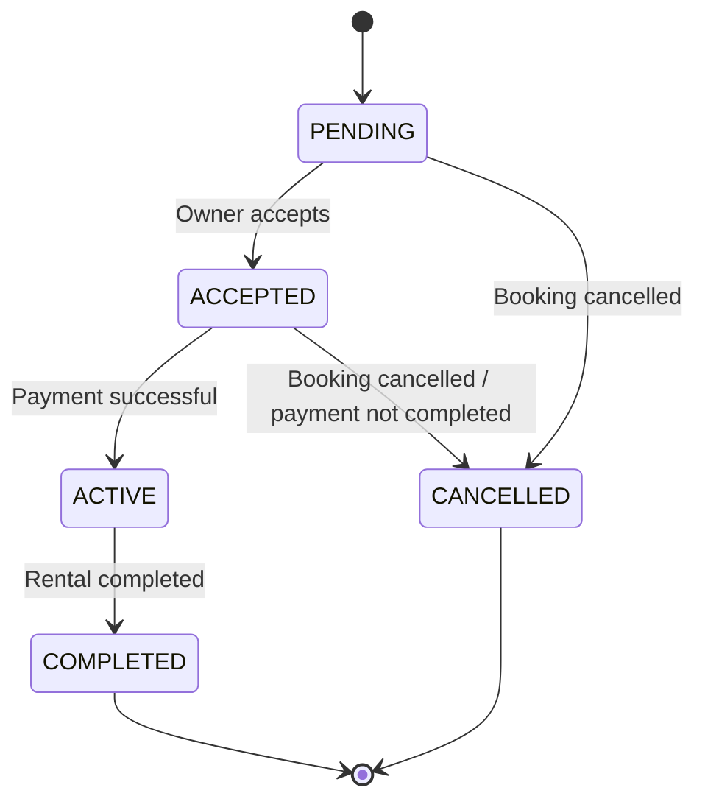
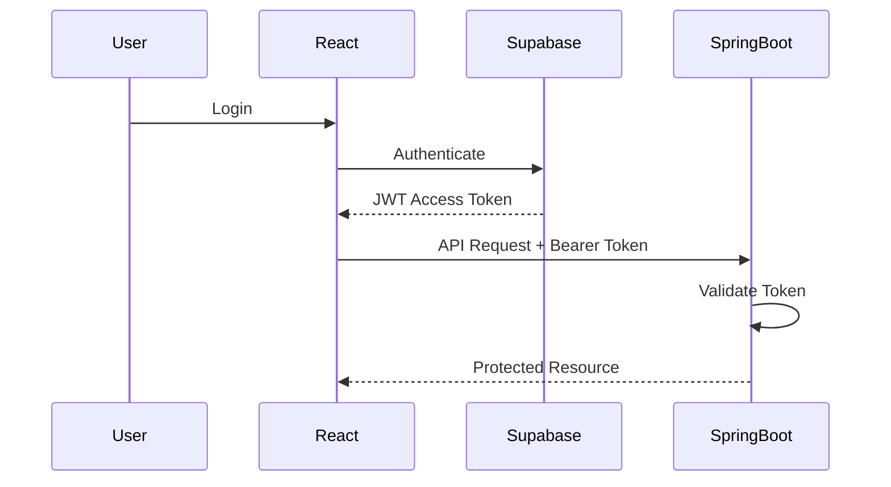

# ORRA – Peer-to-Peer Electronics Rental Platform

ORRA is a full-stack peer-to-peer electronics rental marketplace that enables users to **list, discover, book, and rent electronic products** such as cameras, drones, appliances, and other electronic devices.

The platform handles the complete rental lifecycle, including product listings, booking management, payment processing, authentication, asynchronous event processing, and user notifications.

---

## Features

- User authentication and authorization
- Create and manage electronic product listings
- Browse available products
- Book products for a rental period
- Owner-controlled booking approval
- Payment processing through a dedicated .NET service
- Asynchronous payment event processing using RabbitMQ
- Booking lifecycle management
- Product availability management
- Wishlist functionality
- Product reviews and ratings
- User notifications
- Prevention of owners booking their own products

---

## Tech Stack

### Frontend

- React.js
- Redux Toolkit
- Tailwind CSS
- shadcn/ui
- Axios

### Backend

- Java 17
- Spring Boot
- Spring Security
- Spring Data JPA
- Hibernate
- REST APIs

### Payment Service

- ASP.NET Core
- C#

### Database

- PostgreSQL

### Authentication

- Supabase Authentication
- JWT-based authentication

### Messaging

- RabbitMQ

### Infrastructure & Tools

- Docker
- Maven
- Git
- GitHub

---

## System Architecture

ORRA uses a service-oriented architecture where the main application logic is handled by the Spring Boot backend while payment processing is handled by a separate .NET service.



### Architecture Overview

- **React** provides the user interface and communicates with backend services using REST APIs.
- **Spring Boot** handles listings, bookings, users, reviews, wishlists, notifications, and other core business logic.
- **PostgreSQL** stores application data.
- **Supabase Authentication** manages user authentication and JWT-based sessions.
- **ASP.NET Core** handles payment-related processing and webhook verification.
- **RabbitMQ** enables asynchronous communication between the payment service and the Spring Boot backend.

---

## Booking & Payment Flow

A booking moves through multiple stages before the rental becomes active.



### Flow Explanation

1. A renter selects an available product and creates a booking.
2. The booking is initially created with `PENDING` status.
3. The product owner reviews the request.
4. If accepted, the booking moves to `ACCEPTED`.
5. The renter completes the payment.
6. The payment gateway sends a webhook to the .NET payment service.
7. The .NET service verifies the payment.
8. After successful verification, a `payment.success` event is published to RabbitMQ.
9. The Spring Boot backend consumes the event.
10. The booking status changes to `ACTIVE`.
11. The corresponding product becomes unavailable for other renters.
12. A notification is created for the relevant user.

---

## Booking Lifecycle

The booking lifecycle ensures that every rental moves through controlled states.



### Booking States

| Status | Description |
|---|---|
| `PENDING` | Booking request has been created and is waiting for owner approval |
| `ACCEPTED` | Owner has approved the booking and payment is pending |
| `ACTIVE` | Payment has been completed and the rental is active |
| `COMPLETED` | Rental period has finished |
| `CANCELLED` | Booking has been cancelled |

---

## Business Rules

ORRA implements several business rules to maintain consistency throughout the rental process.

- Product owners cannot book their own products.
- Only active and available products can be booked.
- A new booking starts with `PENDING` status.
- Only the product owner can accept the corresponding booking request.
- An accepted booking must be paid within the allowed payment window.
- Successful payment changes the booking status to `ACTIVE`.
- A product becomes unavailable after successful payment.
- An unavailable product cannot be booked by another renter.
- After the rental is completed, the product becomes available again.
- Payment events are processed asynchronously through RabbitMQ.

---

## Core Modules

### Product Listings

Users can list electronic products for rent with information such as:

- Product name
- Category
- Brand
- Model
- Description
- Daily rental rate
- Security deposit
- Product availability

The platform displays only products that are currently active and available for rental.

### Booking Management

The booking module manages the complete rental lifecycle.

It is responsible for:

- Creating booking requests
- Owner approval
- Booking status transitions
- Rental dates
- Product availability
- Booking cancellation
- Booking completion

### Payment Processing

Payment processing is separated from the main Spring Boot backend.

The .NET payment service is responsible for:

- Handling payment-related operations
- Receiving payment gateway webhooks
- Verifying payment events
- Publishing successful payment events

RabbitMQ is used to communicate successful payment events to the Spring Boot backend.

### Notifications

Notifications are generated for important booking and payment events so users can track changes to their rental requests.

### Reviews

Users can provide reviews and ratings associated with completed rental experiences.

### Wishlist

Users can save products to their wishlist for later viewing.

---

## Database Design

PostgreSQL is used as the primary relational database.

Major entities include:

```text
Users
  │
  ├── Listings
  │      │
  │      ├── Bookings
  │      │      │
  │      │      └── Transactions
  │      │
  │      └── Reviews
  │
  ├── Wishlist
  │
  └── Notifications
```

### Major Tables

| Table | Purpose |
|---|---|
| `users` | Stores user information |
| `listings` | Stores electronic products listed for rent |
| `bookings` | Stores rental booking information |
| `transactions` | Stores payment transaction information |
| `reviews` | Stores ratings and reviews |
| `wishlist` | Stores products saved by users |
| `notifications` | Stores user notifications |

---

## Backend Architecture

The Spring Boot backend follows a layered architecture.

```text
Client Request
      │
      ▼
Controller
      │
      ▼
Service
      │
      ▼
Repository
      │
      ▼
Spring Data JPA / Hibernate
      │
      ▼
PostgreSQL
```

### Responsibilities

**Controller Layer**

Handles HTTP requests and responses.

**Service Layer**

Contains application business logic and booking rules.

**Repository Layer**

Provides database access using Spring Data JPA.

**Entity Layer**

Maps Java objects to PostgreSQL tables using JPA/Hibernate.

**DTO Layer**

Transfers required data between the API and client without exposing persistence entities directly.

---

## REST API Overview

The Spring Boot backend exposes REST APIs for the application's core functionality.

Major API groups include:

```text
Authentication APIs
User APIs
Listing APIs
Booking APIs
Review APIs
Wishlist APIs
Notification APIs
```

The frontend communicates with these APIs using Axios.

---

## Authentication Flow

ORRA uses Supabase Authentication with JWT-based sessions.



The frontend attaches the access token to protected API requests:

```text
Authorization: Bearer <access-token>
```

Authorization rules are enforced by the backend rather than relying only on frontend restrictions.

---

## Project Structure

```text
Orra/
│
├── Orra-Backend-SpringBoot/
│   └── Orrabackend/
│       └── Spring Boot backend
│
├── Orra-Frontend/
│   └── React frontend
│
├── Orra-backend-dotnet/
│   └── .NET payment service
│
├── Orra-databases/
│   └── orra_database/
│       └── PostgreSQL database scripts
│
└── README.md
```

---

## Running the Project Locally

### Prerequisites

Install the following before running the project:

- Java 17+
- Maven
- Node.js
- npm
- .NET SDK
- PostgreSQL
- RabbitMQ
- Docker (optional)
- Git

### Clone the Repository

```bash
git clone https://github.com/atul94063/Orra.git
cd Orra
```

### Start the Spring Boot Backend

```bash
cd Orra-Backend-SpringBoot/Orrabackend
mvn spring-boot:run
```

### Start the React Frontend

```bash
cd Orra-Frontend
npm install
npm run dev
```

### Start the .NET Payment Service

Navigate to the .NET service directory and run:

```bash
dotnet restore
dotnet run
```

### Database

Create the PostgreSQL database and configure the required database connection properties before starting the backend.

Environment-specific credentials and secrets should be provided through environment variables and should not be committed to the repository.

---

## Security

The application follows several security practices:

- JWT-based authentication
- Spring Security for protected backend endpoints
- Backend authorization checks
- Environment variables for sensitive configuration
- Payment webhook verification
- Validation of booking ownership and permissions
- DTOs to avoid exposing persistence entities directly

---

## Future Improvements

Planned improvements include:

- Automated unit and integration testing
- Swagger / OpenAPI documentation
- Docker Compose setup for the complete application
- GitHub Actions CI/CD pipeline
- Improved database indexing
- Centralized exception handling
- Improved application logging
- Deployment to a cloud platform

---

## Repository

GitHub:  
https://github.com/atul94063/Orra

---

## Author

**Atul Golchha**

Full-Stack Developer focused on Java, Spring Boot, React, REST APIs, PostgreSQL, and backend development.
